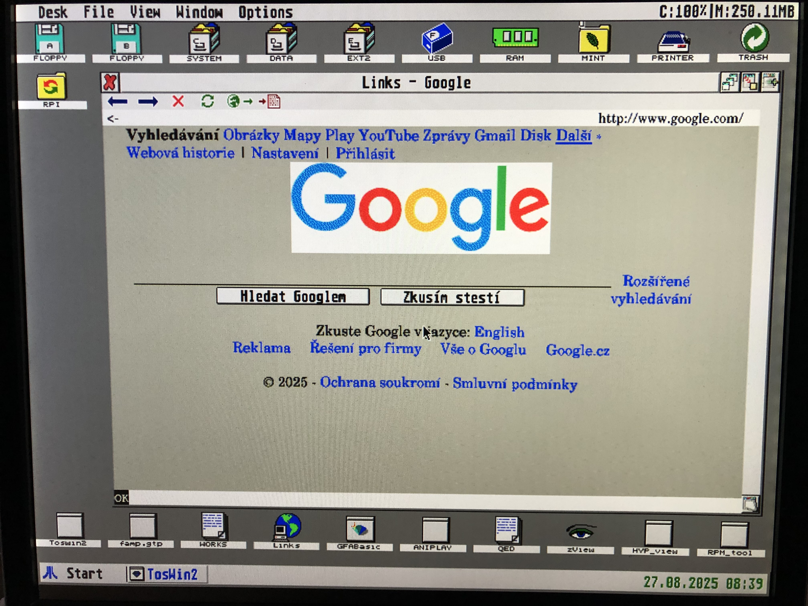
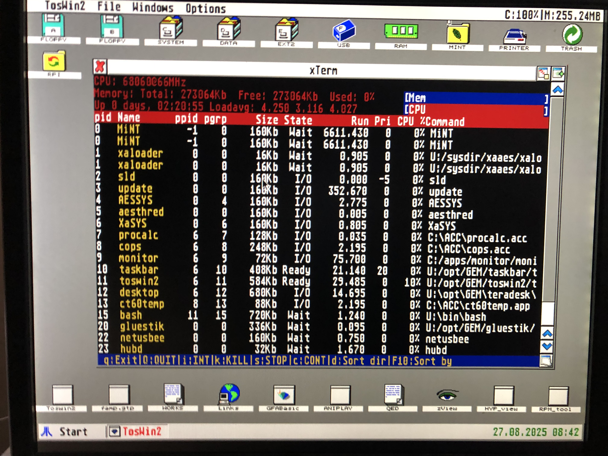
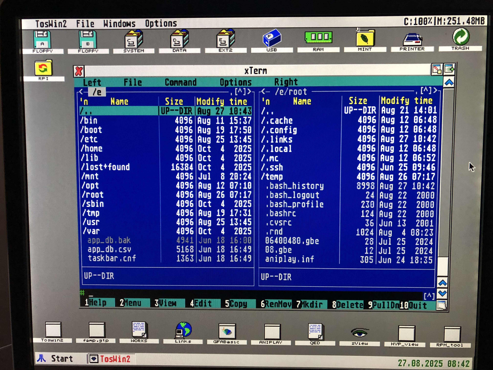

# FreeMiNT OS Distro
A complete bootable FreeMiNT distribution for 32-bit Atari computers.

## Overview
This project delivers a ready-to-use FreeMiNT operating system image for the **Atari Falcon**, **TT**, and compatible accelerators.  
It is designed to be easy to install, fully bootable, and equipped with a modern Unix-like userland.

## Installation
- Download the bootable image from **[here](https://ns.mpsoftware.cz/filehosting/mint.img)** 
- The release includes a prebuilt image for a **4 GB card**.  
- Write the raw image to your SD/CF card using `dd`, [Balena Etcher](https://etcher.balena.io), or any other imaging tool.  

### Advanced installation (manual)
For advanced users, the repository also provides TAR archives of the **C:** and **E.:** partitions.  
- Prepare the partitions manually:  
  - **C:** → FAT12/16 (bootable)  
  - **D:** → is planed for your personal data. Stay untached when reinstaling or update OS  
  - **E:** → EXT2  
- Copy the contents of the TAR archives into the corresponding partitions.  
- ⚠️ Recommended only for experienced users.

## Hardware requirements
- Supported systems:  
  - **Atari Falcon (stock)**  
  - **DFB1x accelerators**  
  - **CT60/CT63 accelerators**  
- Minimum: **14 MB RAM** (TT-RAM expansion strongly recommended)  
- Display: preconfigured for 640x480 16color, switch to 256color get Hires **Videl 800×606, 256 colors**  
  - If you experience display issues, run **Videlity** and adjust the video settings for your monitor.  
- Networking support: **NetUSBee** and **PicoWiFi**

## Included software
- **Latest FreeMiNT kernel**  
- **Unix userland** with a wide set of utilities  
- **XaAES** graphical environment with **TeraDesk** desktop  
- **Web browsers:**  
  - [Links](http://links.twibright.com/) (with modern SSL/TLS support and GUI)  
  - [HighWire](http://highwire.atari-users.net/) (lightweight HTML browser)  
  - [NetSurf](https://www.netsurf-browser.org/) (modern CSS-capable browser)  
- **Development tools:** Pure C, GCC, Python, GFA Basic, and more  
- **New utilities:**  
  - `curl` (with modern SSL/TLS support)
  - `wget` (with modern SSL/TLS support)
  - `Midnight Commander (mc)`  (2025) 
- **Package management:**  
  - Easy installation of **RPM packages** from **[sparemint](https://freemint.github.io/sparemint/sparemint/download.html)**  
  - Included **GUI package manager** for convenient browsing and installation  
- **Online updater** for keeping your system up to date

## Getting started
1. Download the image
2. Write it to your card and insert it into your Atari.  
3. Boot the machine from drive **C:**.  
4. XaAES + TeraDesk will start automatically.  
5. Explore the preinstalled tools (`mc`, `links`, `highwire`, `netsurf`, etc.) or begin coding with the included compilers.

## Notes
- This distribution is **actively maintained**.  
- Use the included **online updater** to stay current.  
- Additional software can be easily installed from **sparemint RPM repositories** using the included package tools.  
- Contributions, feedback, and bug reports are welcome.

## Screenshots 

