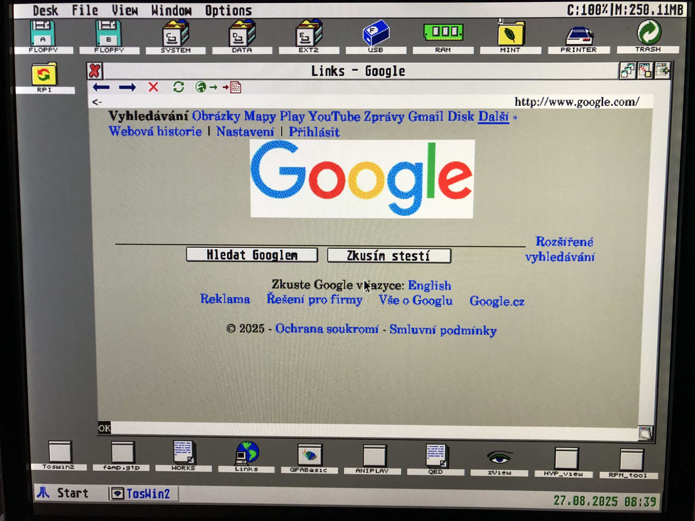
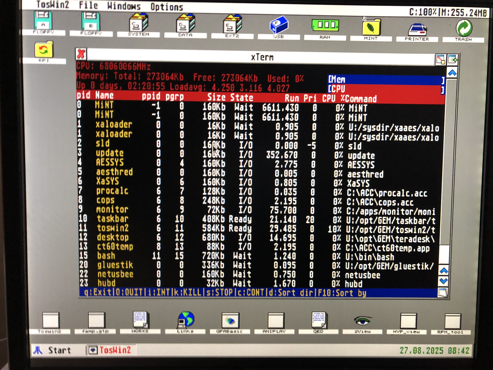
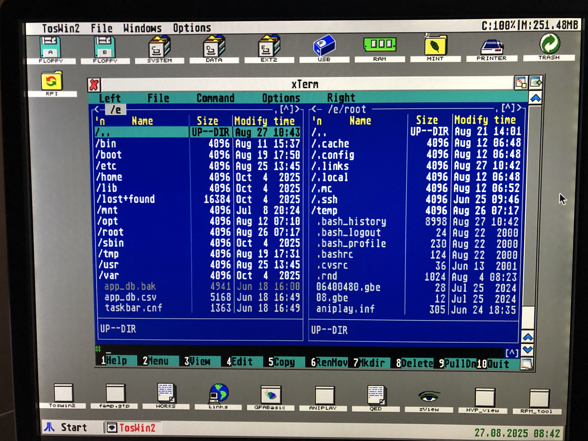

# FreeMiNT OS Distro 26.1

> 🚀 Ready-to-boot FreeMiNT distribution for Atari Falcon, TT and accelerator systems

---

## ✨ Highlights

- 🧠 **Stable and refined** – major stability improvements in this release  
- ⚡ **Ready in minutes** – just flash and boot  
- 🖥️ **Modern Unix-like environment** on classic Atari hardware  
- 🌐 **Networking out of the box** (NetUSBee / PicoWiFi)  
- 📦 **Package manager included** (RPM / sparemint)  
- 🧰 **Development-ready** – GCC, Python, Pure C and more  
- 🌍 **Web-based control & file access** via `stool.tos`  

---

## 🧾 Overview

FreeMiNT OS Distro is a complete, preconfigured operating system image designed for:

- **Atari Falcon (stock)**
- **Atari TT**
- Systems with **DFB1x** or **CT60 / CT63 accelerators**

It delivers a fully functional Unix-like system with GUI, networking, development tools, and modern utilities — ready to use immediately after boot.

---

## 💾 Installation

1. Download the image:  
   https://ns.mpsoftware.cz/filehosting/download.php  

2. Write it to SD / CF card:
   ```sh
   dd if=card.img of=/dev/sdX bs=1M status=progress
   ```

3. Insert the card into your Atari  
4. Boot from drive **C:**  

✔ System boots directly into GUI

---

## 🧠 HDDRIVER

This distribution includes a **demo version of HDDRIVER**, kindly provided by Uwe Seimet.

⚠️ The demo version has limitations.

To unlock full functionality, replace:
HDDRIVER.SYS

👉 Purchase full version:  
https://www.hddriver.net/

---

## ⚙️ Configuration

Main configuration file:
C:\MINT\1-19-cur\MINT.CNF

### 🖥️ Display

- Default: **640×480 / 256 colors**
- Videlity is included, but disabled by default

---

### 🌐 Networking

Selectable in mint.cnf:

- NetUSBee
- PicoWiFi

---

## 📦 Included software

### 🧩 Core system

- Latest FreeMiNT kernel
- XaAES graphical environment
- TeraDesk desktop

---

### 🌍 Web browsers

- Links
- HighWire
- NetSurf

---

### 🧰 Development tools

- GCC
- Pure C
- Python
- GFA Basic

---

### 🔧 Utilities

- curl
- wget
- Midnight Commander (mc)

---

### 🌐 Remote access (stool.tos)

- stool.tos – lightweight web server running on Atari  
- File management from PC via browser  
- Basic remote control of the system  
- Works over NetUSBee / PicoWiFi  

Modern alternative to uIPtools running directly under FreeMiNT.

---

### 📦 Package management

- RPM packages via sparemint
- GUI package manager included

---

## 🆕 What’s new in 26.1

- Major stability improvements
- Cleaner configuration
- Better usability
- Optimized forked kernel compiled with GCC 12.3.0 (original GCC 7.5.0)
- Access to disk /dev/hda to IDE 0 device
- SCSI writing stability
- stool.tos remote access
- Separation tos things to BGM partition and unix userland to ext2
- When migrating unix userland to another partition, only mint.cnf changing is necessary
- Easy change for using Radeon GPU on CTPCI (in /auto enable fvdi.prg)

---

## 🚀 Getting started

After boot:

- GUI starts automatically
- Use terminal or mc
- Try: links, netsurf

---

## 📌 Notes

- Actively maintained
- New release every ~6 months

---

## 📸 Screenshots

  
  


---

## ❤️ Acknowledgements

- FreeMiNT community  
- sparemint project  
- Uwe Seimet  

---

## 👤 Author

Created and maintained by **Michal Pavlis**, with support from the Czech Atari community.

---

## 📄 License

See individual components for licensing.
