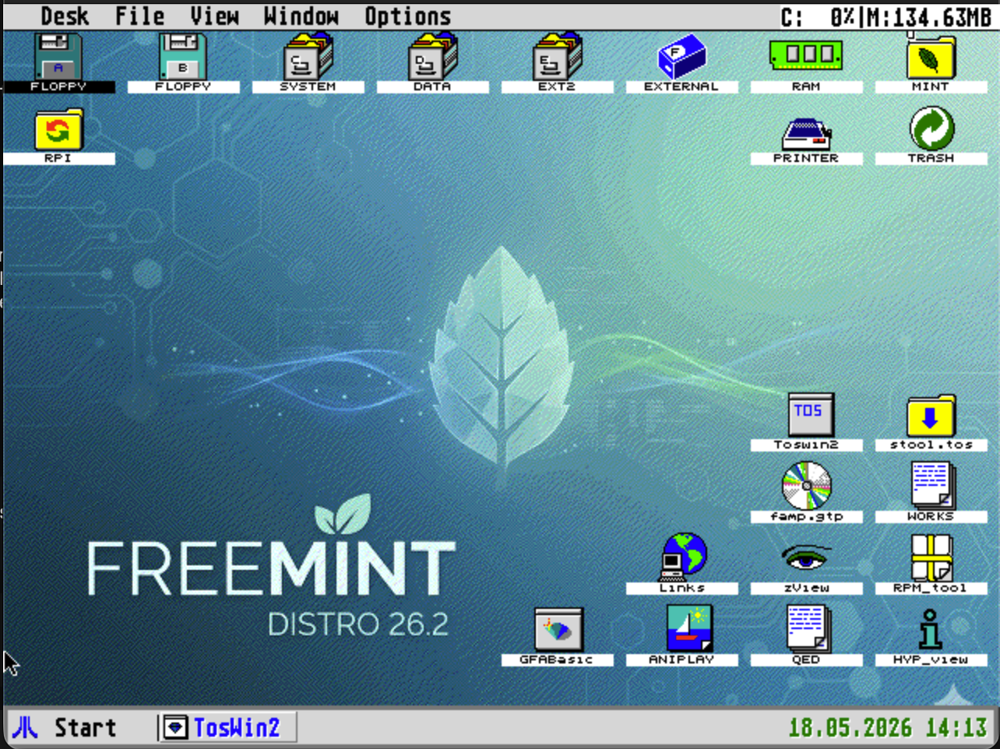
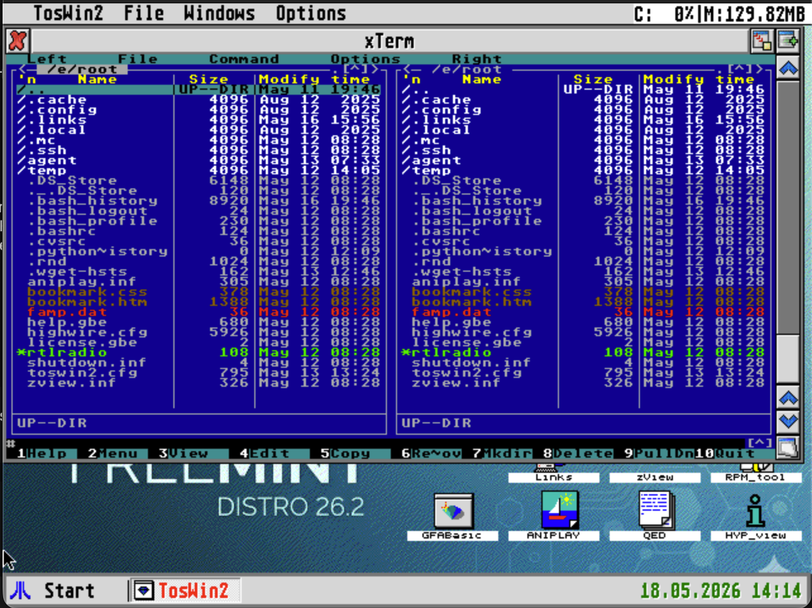

# FreeMiNT OS Distro 26.2

> 🚀 Ready-to-boot FreeMiNT distribution for Atari Falcon, TT and accelerator systems

---

## ✨ Highlights

- 🧠 Stable and refined FreeMiNT environment
- ⚡ Ready in minutes – just flash and boot
- 🖥️ Modern multitasking Unix-like environment on classic Atari hardware
- 🌐 Networking out of the box (PicoWiFi enabled by default)
- 📦 RPM / SpareMiNT package management included
- 🧰 Development-ready system with GCC, Python and classic Atari tools
- 🌍 Web-based remote access via `stool.tos`

---

## 🧾 Overview

FreeMiNT OS Distro is a complete preconfigured operating system image designed for:

- Atari Falcon (stock)
- Atari TT (experimental)
- Atari Falcon with DFB1x accelerators
- Atari Falcon with CT60 / CT63
- Aranym (tested)
- Hatari (experimental)

The distribution provides a practical Unix workstation experience on Atari systems, including GUI, networking, development tools, package management and modern utilities — ready immediately after boot.

---

## 🧮 Recommended hardware

Minimum:

- 68030 + FPU
- 14 MB RAM

Recommended:

- 68060 accelerator
- TT-RAM expansion
- Ethernet adapter (PicoWiFi or NetUSBee)

Systems without FPU support may require disabling selected components.

---

## 💾 Installation

1. Download the image:

https://ns.mpsoftware.cz/filehosting/download.php

2. Write image to SD / CF card:

```sh
dd if=card.img of=/dev/sdX bs=1M status=progress conv=fsync
```

⚠️ Be careful to select the correct target device.

3. Insert the card into your Atari
4. Boot from drive `C:`

✔ System boots directly into GUI

---

## 🧠 HDDRIVER

This distribution includes a demo version of HDDRIVER, kindly provided by Uwe Seimet.

⚠️ The demo version has limitations.

To unlock full functionality, replace:

```txt
HDDRIVER.SYS
```

👉 Full version:

https://www.hddriver.net/

---

## 🗂️ Hybrid TOS / Unix layout

- TOS/GEM environment stored on FAT partition
- Unix userland stored on ext2 partition
- Easy migration of Unix environment between disks
- Only `mint.cnf` adjustment required after migration

This separation improves maintainability and simplifies future upgrades.

---

## ⚙️ Configuration

Main configuration file:

```txt
C:\MINT\1-19-cur\MINT.CNF
```

---

### 🖥️ Display

Default display mode:

- 640×480
- 256 colors

Videlity is included but disabled by default.

For Radeon CTPCI setups:

- enable `fvdi.prg` in `/auto`

---

### 🌐 Networking

Supported networking devices:

- PicoWiFi (default)
- NetUSBee

PicoWiFi is enabled by default in 26.2.

---

## 📦 Included software

### 🧩 Core system

- Latest FreeMiNT kernel
- XaAES graphical environment
- TeraDesk desktop

---

### 🌍 Web browsers

- Links
- HighWire
- NetSurf

---

### 🧰 Development tools

- GCC 15.2
- Python 3.11
- Pure C
- GFA Basic

---

### 🔧 Utilities

- curl
- wget
- Midnight Commander (mc)

---

### 🌐 Remote access (`stool.tos`)

- Lightweight web server running directly on Atari
- File management from PC browser
- Basic remote system control
- Works via PicoWiFi or NetUSBee

Modern alternative to uIPtools running directly under FreeMiNT.

---

### 📦 Package management

- RPM package support via SpareMiNT
- GUI package manager included

---

## 🆕 What’s new in 26.2

- Improved overall system stability
- PicoWiFi enabled by default
- Fixed networking performance problems
- New optimized Unix userland
- GCC upgraded to 15.2
- Python upgraded to 3.11
- Improved SCSI write stability
- Proper IDE access via `/dev/hda`
- Cleaner configuration and easier maintenance
- Further optimized FreeMiNT kernel build

---

## 🚀 Getting started

After boot:

- GUI starts automatically
- Open terminal or Midnight Commander
- Try:
  - `links`
  - `netsurf`
  - `mc`

---

## 📸 Screenshots

<p align="center">
  
  

</p>

---

## 📌 Notes

- Actively maintained
- New release approximately every 6 months
- Optimized for real Atari hardware
- Designed for practical daily usability

---

## ❤️ Acknowledgements

- FreeMiNT community
- SpareMiNT project
- Uwe Seimet
- Czech Atari community

---

## 👤 Author

Created and maintained by **Michal Pavlis**

---

## 📄 License

See individual components for their respective licenses.
